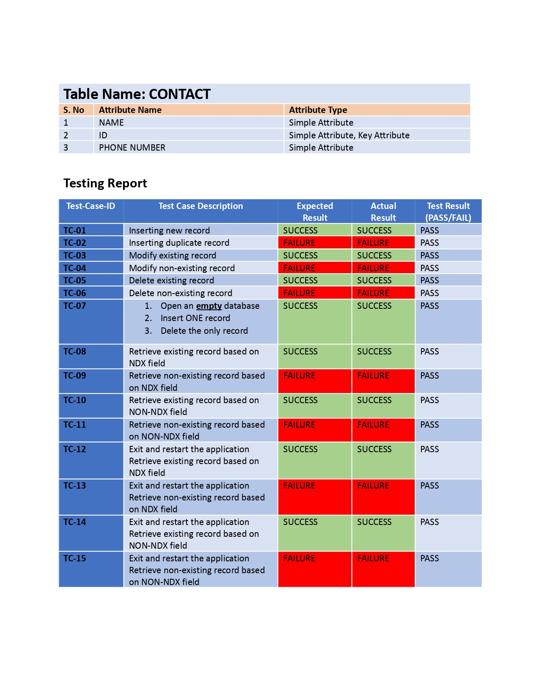

# Introduction

The program is a menu-driven implementation of a DBMS storing contact information

# Instructions

Unpack the archive into a folder. Open terminal in the folder containing the program files. Compile with `gcc bst.c rollno_contact.c rollno_pds.c main.c`, and execute with `./a.out`. 
